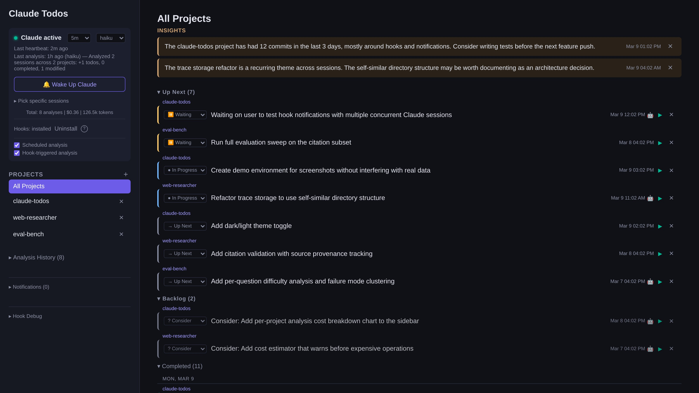

# Claude Todos

A self-managing todo app powered by Claude. It watches your [Claude Code](https://docs.anthropic.com/en/docs/claude-code) sessions and automatically discovers what you're working on — marking tasks complete, suggesting next steps, tracking new projects, and sending you notifications when Claude needs your attention.



## How It Works

1. [Claude Code hooks](docs/hooks.md) detect session lifecycle events (start, end, permission requests) in real time
2. When a session ends or needs attention, analysis is triggered immediately — Claude reads the session transcript to identify completed work and suggest new tasks
3. Results are applied to your todo list — completing tasks, adding new ones, discovering new projects
4. A periodic scheduler (default 30m) acts as a fallback, catching sessions that occurred while the app was offline
5. A web UI shows everything in real time, with full analysis history and usage tracking

## Quick Start

**Prerequisites:** Python 3.9+, Node.js 20.19+, [Claude Code](https://docs.anthropic.com/en/docs/claude-code) installed

### Option 1: Let Claude do it

Clone the repo and open Claude Code inside it:

```bash
git clone https://github.com/eranhirs/claude-todos.git
cd claude-todos
claude
```

Then just ask Claude to install and run the project. It has all the context it needs.

### Option 2: Run it yourself

```bash
git clone https://github.com/eranhirs/claude-todos.git
cd claude-todos
./start.sh
```

Open http://localhost:5151.

### Option 3: Development mode (with hot reload)

```bash
# Terminal 1
python3 -m venv .venv && .venv/bin/pip install -r requirements.txt
.venv/bin/python -m uvicorn backend.main:app --port 5151

# Terminal 2
cd frontend && npm install && npm run dev
```

Open http://localhost:5173.

## Features

### Real-Time Hooks & Analysis
- **Claude Code hooks** — lifecycle hooks trigger analysis instantly when sessions end or need attention
- **Notifications** — alerts when Claude is waiting for tool approval or user input
- **One-click install** — install/uninstall hooks directly from the UI
- **Periodic fallback** — scheduler (default 30m, configurable 1–60m) catches sessions from while the app was offline
- **Smart analysis** — Claude reads session transcripts to understand what was done and what's next
- **Per-project analysis** — each project's sessions are analyzed independently for accurate context
- **Model selection** — choose which Claude model runs analysis (haiku, sonnet, opus)
- **Manual trigger** — "Wake Up Claude" button for on-demand analysis
- **Session picker** — select specific sessions to analyze, or let the scheduler pick recent ones
- **Debug panel** — view hook event log and current session states for troubleshooting

### Todo Management
- **Six statuses** — next, in progress, waiting, completed, consider (backlog), stale
- **Two sources** — todos from Claude (auto-detected) and from you (manually added)
- **Run with Claude** — click play on any todo to spawn a Claude Code session that works on it in the project directory, with streaming output
- **Insights** — Claude generates actionable suggestions during analysis, shown as dismissible banners
- **Multi-project** — organize and filter todos across all your projects

### Monitoring & History
- **Analysis history** — expandable entries showing what changed each run, with full prompt/reasoning/response
- **Cost tracking** — per-run and cumulative cost in USD, token counts, and duration
- **Notifications** — in-app toasts and browser notifications for completed tasks, session events, and new waiting todos
- **Notification log** — scrollable history of recent notifications in the sidebar

## Tech Stack

| Layer    | Tech                         |
|----------|------------------------------|
| Backend  | FastAPI + APScheduler        |
| Frontend | React 19 + TypeScript + Vite |
| Storage  | JSON files (atomic writes)   |
| AI       | Claude CLI (`claude -p`)     |

## Documentation

- [Architecture](docs/architecture.md) — system overview and directory structure
- [Setup & Operations](docs/setup.md) — installation, running, auto-start on login
- [Analysis Pipeline](docs/analysis.md) — how Claude analyzes sessions
- [Hooks](docs/hooks.md) — real-time session monitoring via Claude Code hooks
- [API Reference](docs/api.md) — all REST endpoints

## License

MIT
