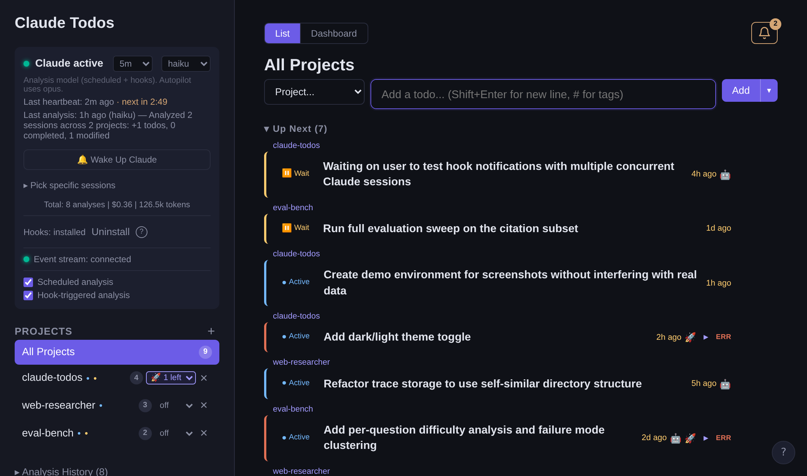
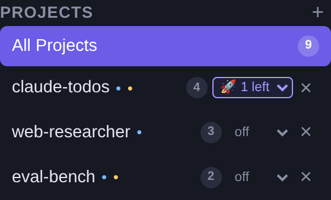
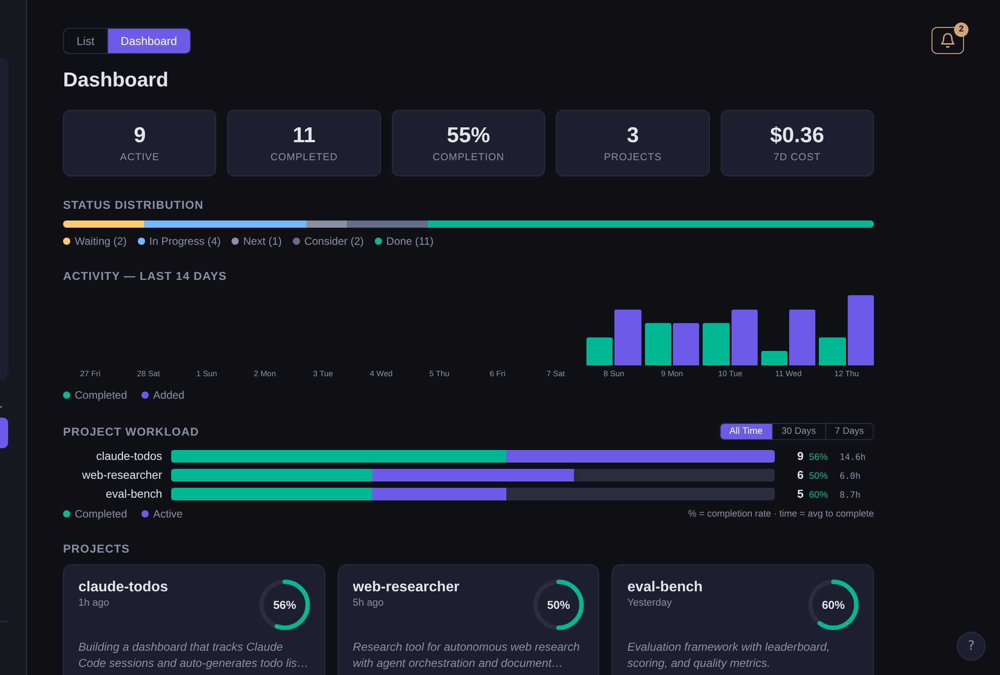

# Claude Todos

A self-managing todo app powered by Claude. It watches your [Claude Code](https://docs.anthropic.com/en/docs/claude-code) sessions and automatically discovers what you're working on — marking tasks complete, suggesting next steps, and tracking new projects. With **Autopilot**, it goes further: Claude automatically picks up todos and works on them, creating a closed loop where analysis discovers work → Autopilot executes it → the cycle repeats.



## How It Works

1. [Claude Code hooks](docs/hooks.md) detect session lifecycle events (start, end, permission requests) in real time
2. When a session ends or needs attention, analysis is triggered immediately — Claude reads the session transcript to identify completed work and suggest new tasks
3. Results are applied to your todo list — completing tasks, adding new ones, discovering new projects
4. **Autopilot** picks up "next" todos and runs them automatically — Claude works on each task in the project directory, then the cycle repeats
5. A periodic scheduler (default 30m) acts as a fallback, catching sessions that occurred while the app was offline
6. A web UI shows everything in real time, with full analysis history and usage tracking

## Quick Start

**Prerequisites:** Python 3.9+, Node.js 20.19+, [Claude Code](https://docs.anthropic.com/en/docs/claude-code) installed

### Option 1: Let Claude do it

Clone the repo and open Claude Code inside it:

```bash
git clone https://github.com/eranhirs/claude-todos.git
cd claude-todos
claude
```

Then just ask Claude to install and run the project. It has all the context it needs.

### Option 2: Run it yourself

```bash
git clone https://github.com/eranhirs/claude-todos.git
cd claude-todos
./start.sh
```

Open http://localhost:5151.

### Option 3: Development mode (with hot reload)

```bash
# Terminal 1
python3 -m venv .venv && .venv/bin/pip install -r requirements.txt
.venv/bin/python -m uvicorn backend.main:app --port 5151

# Terminal 2
cd frontend && npm install && npm run dev
```

Open http://localhost:5173.

## Features

### Real-Time Hooks & Analysis
- **Claude Code hooks** — lifecycle hooks trigger analysis instantly when sessions end or need attention
- **Notifications** — alerts when Claude is waiting for tool approval or user input
- **One-click install** — install/uninstall hooks directly from the UI
- **Periodic fallback** — scheduler (default 30m, configurable 1–60m) catches sessions from while the app was offline
- **Smart analysis** — Claude reads session transcripts to understand what was done and what's next
- **Per-project analysis** — each project's sessions are analyzed independently for accurate context
- **Model selection** — choose which Claude model runs analysis (haiku, sonnet, opus)
- **Manual trigger** — "Wake Up Claude" button for on-demand analysis
- **Session picker** — select specific sessions to analyze, or let the scheduler pick recent ones
- **Debug panel** — view hook event log and current session states for troubleshooting

### Autopilot
- **Per-project quota** — set how many todos to auto-run per project per cycle (0 = off, 1+ = on)
- **Closed loop** — analysis discovers todos → Autopilot picks up "next" todos → Claude works on them → next analysis discovers more → repeat
- **Sequential execution** — within a project, todos run one at a time (oldest first) to avoid conflicts
- **No global toggle** — each project controls its own Autopilot independently from the project list sidebar



### Todo Management
- **Six statuses** — next, in progress, waiting, completed, consider (backlog), stale
- **Two sources** — todos from Claude (auto-detected) and from you (manually added)
- **Run with Claude** — click play on any todo to spawn a Claude Code session that works on it in the project directory, with streaming output
- **Insights** — Claude generates actionable suggestions during analysis, shown as dismissible banners
- **Multi-project** — organize and filter todos across all your projects

### Monitoring & History
- **Dashboard** — bird's-eye view: active vs. completed counts, completion rate, analysis cost, status distribution, 14-day activity chart, and per-project workload
- **Analysis history** — expandable entries showing what changed each run, with full prompt/reasoning/response
- **Cost tracking** — per-run and cumulative cost in USD, token counts, and duration
- **Notifications** — in-app toasts and browser notifications for completed tasks, session events, and new waiting todos
- **Notification log** — scrollable history of recent notifications in the sidebar



## Sample Use Case: The Self-Improving Loop

Here's a concrete example showing how Claude Todos creates a closed feedback loop where Claude discovers its own work, executes it, and keeps going.

### Step 1: You add a seed todo

In the UI, you manually add a single todo to your project:

> "Analyze this codebase and suggest 3–5 concrete improvements (performance, code quality, missing tests, etc.)"

Set its status to **next** so Autopilot picks it up.

### Step 2: Autopilot runs the todo

Autopilot sees the "next" todo, spawns a Claude Code session in your project directory, and Claude gets to work. It reads through the codebase, identifies improvements, and — because the hook is installed — the session transcript is captured automatically.

### Step 3: Analysis creates new todos

When the session ends, the analysis pipeline kicks in. Claude reads the transcript and discovers that the session produced several actionable suggestions. It creates new todos on your behalf, for example:

- 📦 "Add unit tests for the payment module"
- ⚡ "Replace N+1 queries in the dashboard endpoint with a single join"
- 🧹 "Extract duplicated validation logic into a shared utility"

Each new todo is added with status **next**, ready for the next Autopilot cycle.

### Step 4: Autopilot executes the new todos

Autopilot picks up the first "next" todo — say, "Add unit tests for the payment module" — and runs it. Claude writes the tests, the session ends, and analysis fires again. This time it might notice:

- ✅ Mark "Add unit tests for the payment module" as **completed**
- 💡 Add a new insight: "Test coverage revealed an unhandled edge case in refund calculations"
- 📝 Create a new todo: "Fix refund calculation when discount exceeds subtotal"

### Step 5: The cycle repeats

The loop continues: Autopilot runs todos → analysis discovers what was done and what's next → new todos appear → Autopilot picks them up. Each cycle makes the codebase a little better, and each analysis surfaces the next round of work.

You can monitor all of this from the Dashboard — watching completion rates climb, reviewing analysis history, and adjusting Autopilot quotas per project to control the pace.

## Tech Stack

| Layer    | Tech                         |
|----------|------------------------------|
| Backend  | FastAPI + APScheduler        |
| Frontend | React 19 + TypeScript + Vite |
| Storage  | JSON files (atomic writes)   |
| AI       | Claude CLI (`claude -p`)     |

## Documentation

- [Architecture](docs/architecture.md) — system overview and directory structure
- [Setup & Operations](docs/setup.md) — installation, running, auto-start on login
- [Analysis Pipeline](docs/analysis.md) — how Claude analyzes sessions
- [Hooks](docs/hooks.md) — real-time session monitoring via Claude Code hooks
- [API Reference](docs/api.md) — all REST endpoints

## License

MIT
